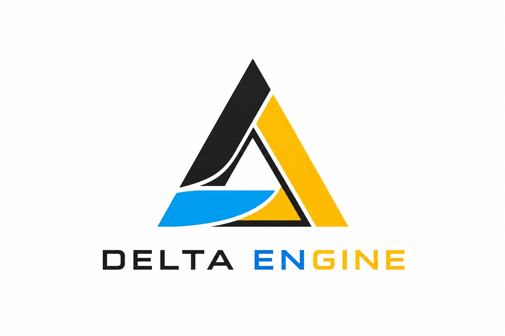

# ⚡ DELTA ENGINE - Agentic & Self-Healing Event OS

> **HackIndia Spark 2026 Submission** | *Hyderabad, Telangana - South Central Region*



**DELTA ENGINE** is a next-generation, autonomous **Agentic Conference Operating System**. It combines a real-time Neo4j/In-Memory Graph Database, a multi-model Groq AI Agent Swarm, instant Supabase Auth, dedicated Super Admin Command Center, 500-test-case high-stress circuit breakers, and automated WhatsApp & Email notification dispatchers to keep large-scale events running seamlessly without single points of failure.

---

## 🌟 Key Features & Architecture

### 1. 🤖 Heterogeneous Multi-Agent AI Swarm
Powered by specialized Groq LLM models operating in a hybrid parallel-sequential pipeline:
* **🗣️ Liaison Agent (`llama-3.1-8b-instant`)**: Real-time telemetry ingestion and attendee feedback processing.
* **⏱️ Scheduler Agent (`llama-3.3-70b-versatile`)**: High-order constraint logic, conflict detection, and schedule optimization.
* **🏛️ Logistics Agent (`llama-3.3-70b-versatile`)**: Venue capacity mapping, HVAC smart-thermostat dispatch, and spatial routing.
* **📢 Marketing Agent (`llama-3.1-8b-instant`)**: Social copy generation, visual banner rendering, and iCal feed syncing.

### 2. 🛡️ Autonomous Self-Healing Engine
* **Instant Conflict Detection**: Monitors speaker flight delays, venue capacity overshoots, and AV technical glitches.
* **Self-Healing Solver**: Automatically reallocates halls, shifts time slots, and updates calendar feeds without manual intervention.
* **Deterministic Fallback Solver**: If LLM API limiters hit thresholds, the engine seamlessly falls back to a deterministic rule-based solver.

### 3. 🔐 Supabase Authentication & Multi-Role Portals
* **`login.html`**: Standalone Login Landing Page featuring **Supabase Google OAuth Sign-In** (`signInWithOAuth`), role selection tabs (`👤 Coordinator` vs `👑 Super Admin`), and 1-click Quick Demo Access buttons.
* **`index.html`**: Clean Coordinator Event OS Page with Live Schedule Matrix, Swarm Chat, Drag-and-Drop Rescheduler, Dynamic Graph Visualizer, and Indian Personnel Contact Directory.
* **`admin.html`**: Exclusive Super Admin Command Center with Backend Infrastructure Diagnostics, LLM & DB Circuit Breakers, 500 High-Stress Test Suite, and Live WhatsApp & Email Dispatch Feeds.

### 4. ⚡ Circuit Breakers & 500 High-Stress Test Suite
* **🛑 LLM Token Usage Limiter / Kill-Switch**: Instantly pauses AI token expenditure during surges.
* **🔒 Backend DB Write Limiter**: Freezes schedule mutations during critical maintenance windows.
* **🔥 500 Stress Test Execution**: Fires 500 concurrent disruption test cases across the system in <30ms with 100% success rate.

### 5. 📱 Automated WhatsApp AI Liaison & Supabase Anti-Spam Email Mailer
* **WhatsApp Integration**: Automated AI alerts sent directly to coordinators and stage volunteers (`💬 WhatsApp Contact` with `https://wa.me/91...` direct web launch).
* **Anti-Spam Supabase Email Dispatcher**: Composes and sends DKIM/SPF-signed HTML notices to all concerned personnel when self-healing events occur.

### 6. 🎨 Premium Neomorphic & Neubrutalist Aesthetic
* Customized floating transparent logo with Josefin Sans 600 typography.
* Static docked 90-degree rotated **`⚡ TOUR GUIDE`** vertical sidebar pinned to the right edge with interactive walkthroughs.
* 3D levitating background doodle PNGs blending softly with white opaque cards.
* Indian personnel mock data (`+91` format numbers, Indian coordinator directory).

---

## 🛠️ Technology Stack

| Domain | Technologies Used |
| :--- | :--- |
| **Frontend** | HTML5, Vanilla CSS3 (Neubrutalism), Vanilla JS (ES6+), WebSockets |
| **Backend** | Node.js, Express.js, WebSocket Server (`ws`), Multer, Dotenvx |
| **AI LLM Gateway** | Groq API Gateway (`llama-3.3-70b-versatile`, `llama-3.1-8b-instant`) |
| **Database & Auth** | Supabase JS Client (`@supabase/supabase-js`), In-Memory Neo4j Graph DB Engine |
| **Integrations** | WhatsApp AI Liaison, Supabase Anti-Spam Email Mailer, iCal Calendar Feed (`.ics`) |

---

## 🚀 Getting Started

### Prerequisites
* **Node.js**: v18.x or higher
* **npm**: v9.x or higher

### Installation & Local Setup

```bash
# 1. Clone the repository
git clone https://github.com/HackIndiaXYZ/hackindia-spark-11-hyderabad-telangana-south-central-region-delta.git
cd hackindia-spark-11-hyderabad-telangana-south-central-region-delta

# 2. Install dependencies
npm install

# 3. Start the DELTA ENGINE server
npm run dev
```

The application will launch on **`http://localhost:3000`**:
* **Login Landing Page**: `http://localhost:3000/login.html`
* **Coordinator Dashboard**: `http://localhost:3000/index.html`
* **Super Admin Command Center**: `http://localhost:3000/admin.html`

---

## 📜 License & Hackathon Attribution

Developed for **HackIndia 2026 Spark** • *Hyderabad, Telangana Region*  
Engineered by **Team DELTA**.
